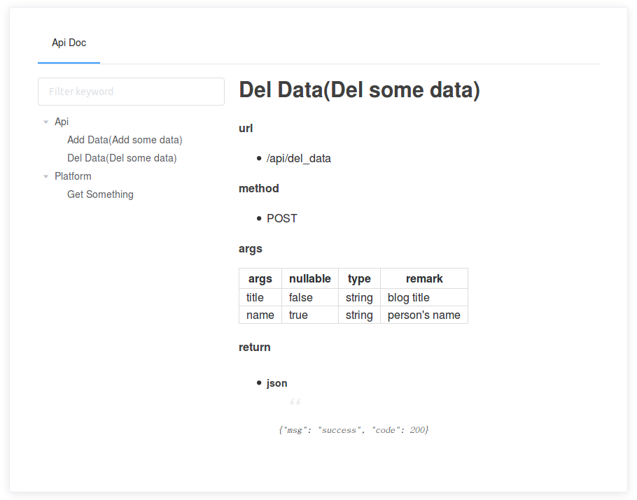

# Flask-Docs

> Adds Docs support to Flask.

Usage
-----

Here is an example:
```
from flask import Flask, render_template, jsonify, Blueprint
from flask_docs import ApiDoc

app = Flask(__name__)
app.config['API_DOC_MEMBER'] = ['api', 'platform']
# app.config['API_DOC_ENABLE'] = False
# app.config['API_DOC_CDN'] = False

ApiDoc(app)

api = Blueprint('api', __name__)
platform = Blueprint('platform', __name__)


@api.route('/add_data', methods=['POST'])
def add_data():
    """Add some data

    Add some data in this routing

    Args:
        pass
 
    Returns:
        pass
    """
    return jsonify({'api': 'add data'})


@api.route('/del_data', methods=['POST'])
def del_data():
    """Del some data

    @@@
    #### args

    | args | nullable | type | remark |
    |--------|--------|--------|--------|
    |    title    |    false    |    string   |    blog title    |
    |    name    |    true    |    string   |    person's name    |

    #### return
    - ##### json
    > {"msg": "success", "code": 200}
    @@@
    """
    return jsonify({'api': 'del data'})


@platform.route('/get_something', methods=['GET'])
def get_something():
    """
    @@@
    #### example
        import requests
        url='http://127.0.0.1:5000/api/get_something'
        try:
            print requests.get(url).text
        except:
            pass
    @@@
    """
    return jsonify({'platform': 'get something'})


app.register_blueprint(api, url_prefix='/api')
app.register_blueprint(platform, url_prefix='/platform')

if __name__ == '__main__':
    app.run(host='0.0.0.0', port=5000, debug=True)
```

Run in /docs/api
-----





Reference
-----

[falsk_api_doc](https://github.com/tobyqin/flask_api_doc/)
